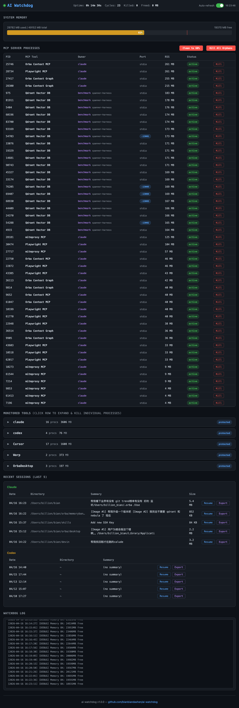
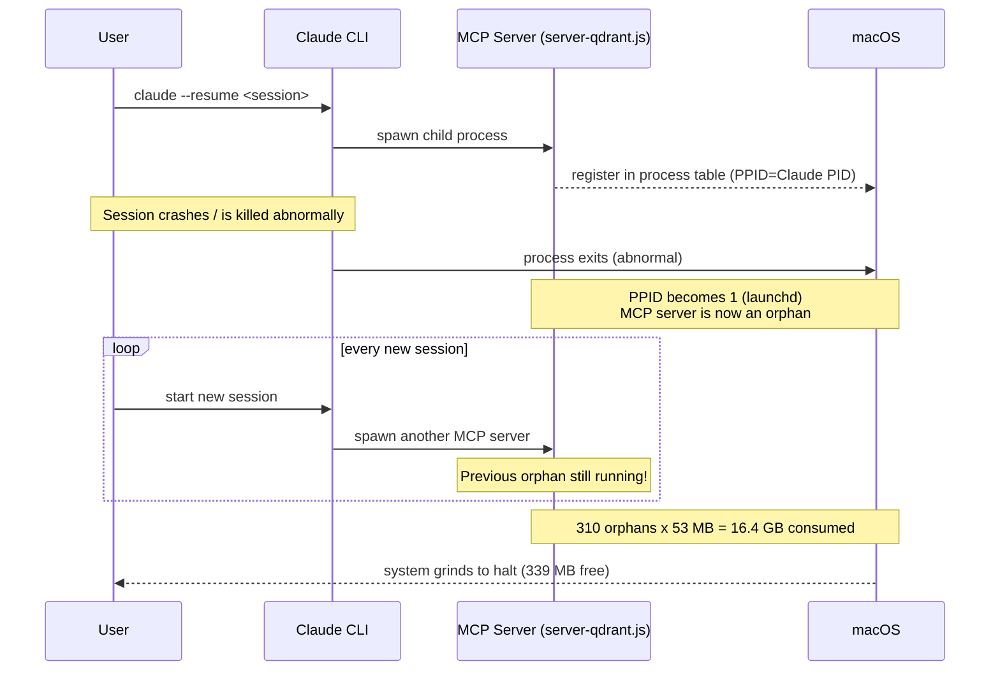
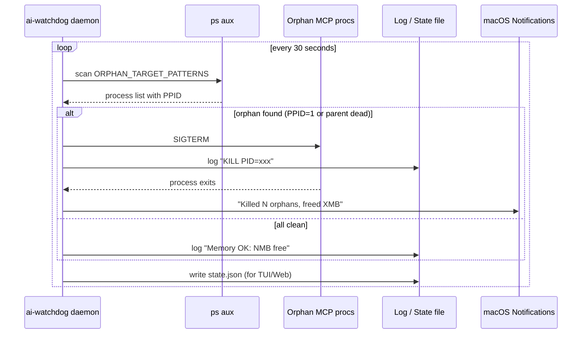
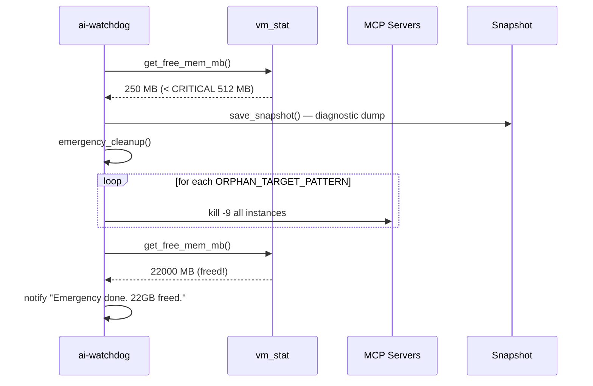
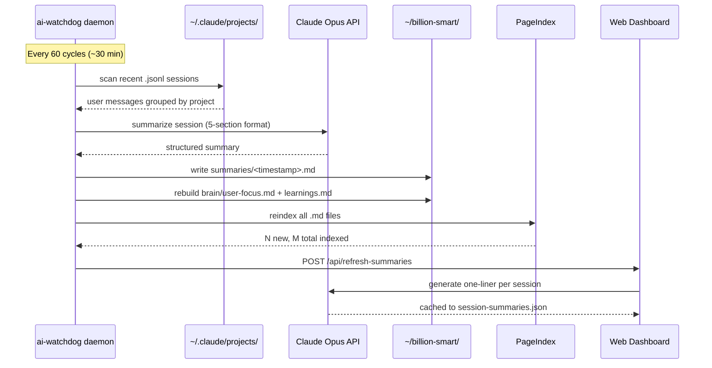
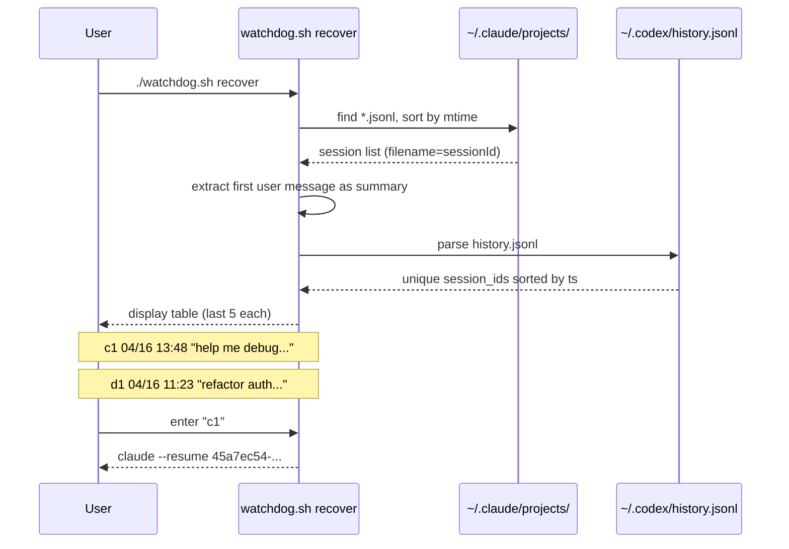
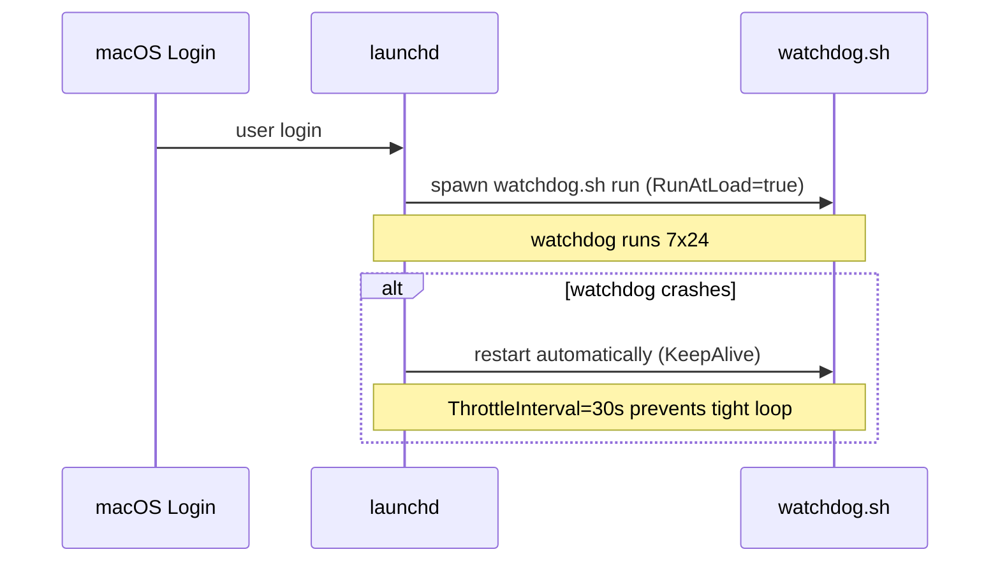

# ai-watchdog


**7x24 AI coding infrastructure for individuals and teams on macOS.**

Two layers. One daemon. Zero npm dependencies.

```
┌─────────────────────────────────────────────────────────────────┐
│                     ai-watchdog                                 │
│                                                                 │
│  ┌─────────────────────────────┐  ┌──────────────────────────┐  │
│  │     🅷  HARNESS LAYER       │  │   🅲  COMPOUND LAYER     │  │
│  │     (Team Infrastructure)   │  │   (Personal Knowledge)   │  │
│  │                             │  │                          │  │
│  │  Orphan Reaper              │  │  Session Memory          │  │
│  │  Memory Guard               │  │  LLM Summaries           │  │
│  │  Swarm Detection            │  │  Project Brains          │  │
│  │  Web Dashboard              │  │  PageIndex Semantic       │  │
│  │  Session Recovery           │  │  Best Practices Library  │  │
│  │  Log Janitor                │  │  Compound Loop           │  │
│  │  LaunchAgent                │  │                          │  │
│  └─────────────────────────────┘  └──────────────────────────┘  │
│                                                                 │
│  Supports: Claude · Codex · Cursor · Orba · Warp               │
└─────────────────────────────────────────────────────────────────┘
```

---

## Why Two Layers?

> Inspired by [superpowers](https://github.com/obra/superpowers), [compound-engineering](https://github.com/EveryInc/compound-engineering-plugin), and [gstack](https://github.com/garrytan/gstack).

**Harness** solves the infrastructure problem that every AI-heavy team hits: MCP orphan processes, memory blowups, session loss. Deploy once, benefit the whole team.

**Compound** solves the knowledge decay problem: "I solved this last week but forgot how." Every 30 minutes, the daemon captures what you learned and indexes it for semantic retrieval — making each session build on the last.

```
                  Compound Engineering Loop
                  ═══════════════════════

  Brainstorm → Plan → Work → Review → COMPOUND → Repeat
                                         ↑
                                   ai-watchdog automates this step
                                   every 30 minutes
```

---

## Screenshots

### Web Dashboard (`http://localhost:7474`)



### Terminal TUI (`./tui.sh`)

Live ANSI dashboard with memory bars, process tables, session recovery, and keyboard shortcuts.

---

# 🅷 Harness Layer — Team Infrastructure

> **Audience:** Any team running AI coding tools on macOS.
> **Goal:** Eliminate the class of problems where AI tools degrade the developer machine.

### The Problem

Every Claude / Codex / Cursor / Orba session spawns **MCP server child processes** (Qdrant, Playwright, Figma, mitmproxy, Chrome DevTools, etc.). When the parent crashes, the children become orphans and silently consume RAM.

```
Real incident:
  Orphan server-qdrant.js:  310 processes  →  16.4 GB RAM
  System free memory:                       →  339 MB
  Result:                                   →  Mac grinding to halt
```

### Harness Capabilities

| Capability | How it works | Who benefits |
|---|---|---|
| **Orphan Reaper** | Scans every 30s, kills MCP procs with PPID=1 | Every developer on the team |
| **Swarm Detection** | Kills extras when >2 copies of same MCP server exist | Heavy multi-session users |
| **Memory Guard** | Emergency cleanup at <512 MB; targeted at <2 GB | Prevents machine lockups |
| **Web Dashboard** | Real-time UI at `localhost:7474` — kill any process, export sessions | Quick triage during incidents |
| **Terminal TUI** | ANSI dashboard refreshing every 3s — memory bars, process counts | Terminal-native users |
| **Session Recovery** | Lists last 5 sessions per tool, prints resume commands | Anyone who lost a session |
| **Log Janitor** | Deletes `debug-*.log` older than 3 days from `.orba/.codex/.claude` | Disk space hygiene |
| **LaunchAgent** | Starts on login, auto-restarts on crash | Zero maintenance after install |
| **Kill Protection** | `claude`, `codex`, `Cursor`, `Warp`, `OrbaDesktop` are NEVER touched | Safety guarantee |

### Team Deployment

```bash
# On each developer's Mac:
git clone git@github.com:bianbiandashen/ai-watchdog.git ~/ai-watchdog
cd ~/ai-watchdog && ./install.sh

# Optional: web dashboard
node web/server.js &
open http://localhost:7474
```

One-time install. Zero config. Survives reboots. No npm dependencies.

### Configuration

All thresholds in `config.sh`:

```bash
CHECK_INTERVAL=30              # scan every 30 seconds
SYSTEM_MEM_MIN_FREE_MB=2048    # warn + cleanup when free < 2 GB
SYSTEM_MEM_CRITICAL_MB=512     # emergency kill when free < 512 MB
PROCESS_MEM_MAX_MB=4096        # kill single proc exceeding 4 GB
ORPHAN_THRESHOLD=2             # keep at most 2 instances per MCP server
LOG_MAX_AGE_DAYS=3             # delete debug logs older than 3 days
```

### What Gets Killed vs. Protected

**Kill targets** (`ORPHAN_TARGET_PATTERNS`):
`server-qdrant.js` · `orba-context-mcp` · `figma.*mcp` · `playwright.*mcp` · `ChromeDevTools.*mcp` · `mitmproxy.*mcp` · `proxyman.*mcp` · `plugin_miniprogram` · `mp-cli.*mcp` · `pageindex`

**Never touched** (`NEVER_KILL_PATTERNS`):
`claude` · `codex` · `Cursor` · `OrbaDesktop` · `Warp` · `claude.*--dangerously`

---

# 🅲 Compound Layer — Personal Knowledge System

> **Audience:** Individual developers who want sessions to build on each other.
> **Goal:** Automate the COMPOUND step — capture, index, and retrieve learnings across sessions.

### The Knowledge Decay Problem

```
Monday:    Spent 2 hours debugging Spanner query timeout → found the fix
Wednesday: Same issue. Forgot the fix. Spent 1.5 hours again.
```

The Compound Layer breaks this cycle. Every 30 minutes, the daemon:

```
┌──────────────┐     ┌──────────────┐     ┌──────────────┐
│  1. CAPTURE  │ ──→ │  2. DISTILL  │ ──→ │  3. INDEX    │
│              │     │              │     │              │
│ Scan active  │     │ LLM extracts │     │ PageIndex    │
│ Claude/Codex │     │ structured   │     │ semantic     │
│ sessions     │     │ learnings    │     │ search       │
└──────────────┘     └──────────────┘     └──────────────┘
         ↓                    ↓                    ↓
   ~/.claude/          ~/billion-smart/      ~/billion-smart/
   projects/           <project>/            pageindex-workspace/
                       summaries/
```

### Compound Capabilities

| Capability | What it does | Compound Loop stage |
|---|---|---|
| **Session Memory** | Every 30 min, scans Claude/Codex sessions and extracts context | CAPTURE |
| **LLM Summaries** | Calls Claude Opus to generate structured session digests | DISTILL |
| **Dashboard Summaries** | LLM-generated one-liner for each active session in the web UI | DISTILL |
| **Project Brains** | Per-project `brain/` with `user-focus.md` (your messages) + `learnings.md` (AI summaries) | COMPOUND |
| **PageIndex** | Semantic search over all accumulated knowledge (vector-free, LLM-reasoning) | RETRIEVE |
| **Best Practices Library** | Curated patterns from superpowers, gstack, compound-engineering | REFERENCE |

### The 30-Minute Cycle

```
Every 60 cycles (≈ 30 min), the daemon runs:

  ① generate_summary        — LLM summarizes recent sessions → ~/billion-smart/<project>/summaries/
  ② run_pageindex_reindex   — Re-indexes all markdown into PageIndex for semantic search
  ③ refresh_dashboard_summaries — LLM generates one-line summaries for the web dashboard
```

### Summary Output Structure

Each LLM summary follows the Compound methodology — 5 sections designed for reuse:

```markdown
### What Worked        — approaches to repeat
### What Failed        — dead ends to avoid
### Key Decisions      — choices and their reasoning
### Learnings          — non-obvious discoveries (highest value)
### Open Issues        — unresolved problems to revisit
```

### Knowledge Storage Layout

```
~/billion-smart/
├── best-practices/           # Curated methodology references
│   ├── superpowers.md        #   obra/superpowers patterns
│   ├── compound-engineering.md #   EveryInc compound loop
│   └── gstack.md             #   garrytan/gstack patterns
├── <project>/                # Per-project knowledge (auto-created)
│   ├── brain/
│   │   ├── user-focus.md     #   Your recent messages (highest weight)
│   │   └── learnings.md      #   AI-distilled session summaries
│   └── summaries/
│       ├── 20260417_1200.md  #   Individual session summaries
│       └── ...               #   (keeps last 48 per project)
├── _global/                  # Cross-project knowledge
│   ├── brain/
│   └── summaries/
├── pageindex-workspace/      # PageIndex semantic index
└── reindex.py                # Re-indexing script
```

### Setup: Personal Knowledge

```bash
# 1. Create the knowledge hub
mkdir -p ~/billion-smart/.venv
python3 -m venv ~/billion-smart/.venv

# 2. Install PageIndex (optional, for semantic search)
pip install pageindex  # or clone to /tmp/PageIndex

# 3. Configure LLM API in ai-watchdog
cat > ~/ai-watchdog/.env << 'EOF'
OPENAI_API_KEY=your-key-here
OPENAI_BASE_URL=https://your-litellm-endpoint
SUMMARY_MODEL=anthropic/claude-opus-4.6
EOF

# 4. (Optional) Add PageIndex as MCP server in Claude Code
# In ~/.claude/settings.json:
# "mcpServers": { "pageindex": { "command": "python", "args": ["-m", "pageindex.mcp"] } }
```

### Querying Your Knowledge

**From the Web Dashboard:**
- Project Brains panel shows per-project brain content
- Session summaries panel shows recent LLM digests
- Best Practices panel shows methodology references

**From Claude Code (with PageIndex MCP):**
```
> Search my knowledge base for learnings about Spanner query timeouts
> What did I learn last week about MCP process management?
```

---

## Alternatives Comparison

| Feature | ai-watchdog | mcp-orphan-monitor | mcp-cleanup | process-police | ccboard |
|---|:---:|:---:|:---:|:---:|:---:|
| Orphan detection & kill | **Yes** | Yes | Yes | Yes | No |
| Memory pressure guard | **Yes** | No | No | No | No |
| Web dashboard | **Yes** | No | No | No | Yes |
| Terminal TUI | **Yes** | No | No | Yes (Linux) | No |
| Session recovery | **Yes** | No | No | No | View only |
| LLM session summaries | **Yes** | No | No | No | No |
| Semantic knowledge search | **Yes** | No | No | No | No |
| Compound loop automation | **Yes** | No | No | No | No |
| launchd auto-start | **Yes** | Yes | Yes | No | No |
| macOS native | **Yes** | Yes | Yes | Linux only | Cross |
| Zero dependencies | **Yes** | No (Python) | Yes | No (Rust) | No (Rust) |

---

<details>
<summary><strong>Architecture — Sequence Diagrams (click to expand)</strong></summary>

### 1 - Orphan Accumulation (the problem)



### 2 - Harness: Normal Scan Cycle



### 3 - Harness: Memory Pressure Emergency



### 4 - Compound: 30-Minute Knowledge Cycle



### 5 - Session Recovery Flow



### 6 - launchd Auto-Start & Keep-Alive



</details>

---

## Project Structure

```
ai-watchdog/
├── watchdog.sh          # Main daemon + CLI dispatcher
├── config.sh            # All thresholds and patterns
├── tui.sh               # Live ANSI terminal dashboard
├── status.sh            # Quick one-shot status
├── install.sh           # launchd LaunchAgent installer
├── uninstall.sh         # Remove LaunchAgent
├── .env                 # LLM API config (never committed)
├── lib/
│   ├── utils.sh         # Logging, notify, memory helpers, safe_kill
│   ├── monitor.sh       # Orphan detection, memory pressure, snapshots
│   ├── cleanup.sh       # Kill routines: orphans, hogs, emergency, logs
│   ├── recovery.sh      # Session list parser and resume helper
│   └── memory.sh        # Compound layer: LLM summaries, PageIndex, dashboard refresh
├── web/
│   ├── server.js        # Node.js API server (zero deps, port 7474)
│   └── public/
│       └── index.html   # Single-file SPA dashboard
├── docs/                # Screenshots
└── logs/                # watchdog.log, state.json, session-summaries.json (gitignored)
```

---

## Usage

| Command | Layer | What it does |
|---|---|---|
| `./install.sh` | Harness | Install LaunchAgent (one-time) |
| `./tui.sh` | Harness | Open live ANSI dashboard |
| `node web/server.js` | Both | Start web dashboard on port 7474 |
| `./status.sh` | Harness | Quick one-shot status print |
| `./watchdog.sh clean` | Harness | Manually run all cleanups now |
| `./watchdog.sh recover` | Harness | Interactive session recovery menu |
| `./watchdog.sh snapshot` | Harness | Save diagnostic snapshot |
| `./uninstall.sh` | Harness | Stop daemon and remove LaunchAgent |

---

## Requirements

- macOS 12+ (uses `launchctl`, `vm_stat`, `osascript`)
- Bash 5+ (`brew install bash` if needed)
- Python 3 (pre-installed on macOS)
- Node.js 18+ (optional, for web dashboard)
- LLM API endpoint (optional, for Compound layer — any LiteLLM-compatible endpoint)

---

## FAQ

**Will this kill my Claude / Codex session?**
No. All CLI tools and GUI apps are in `NEVER_KILL_PATTERNS`. Only MCP server subprocesses are eligible.

**Can I use just the Harness layer without Compound?**
Yes. Without `.env` configured, the Compound layer silently skips. You still get orphan reaping, memory guard, dashboard, and session recovery.

**Does the Compound layer send my code to an API?**
It sends only the **first line of each user message** (truncated to 200 chars) for summary generation. No code, no assistant responses, no file contents.

**How do I query my accumulated knowledge?**
Option A: Web dashboard Project Brains panel. Option B: Configure PageIndex as an MCP server in Claude Code for natural-language search.

**Does this work on Linux?**
Not yet — it uses macOS-specific APIs (`vm_stat`, `osascript`, `launchctl`). PRs welcome.

---

## Contributing

1. Fork the repo
2. Create a feature branch (`git checkout -b feat/my-feature`)
3. Keep the zero-dependency constraint (no npm packages for the bash daemon)
4. Harness changes: test on macOS, ensure `NEVER_KILL_PATTERNS` safety
5. Compound changes: test with and without `.env` (graceful degradation)
6. Submit a PR

---

## License

[MIT](LICENSE)
