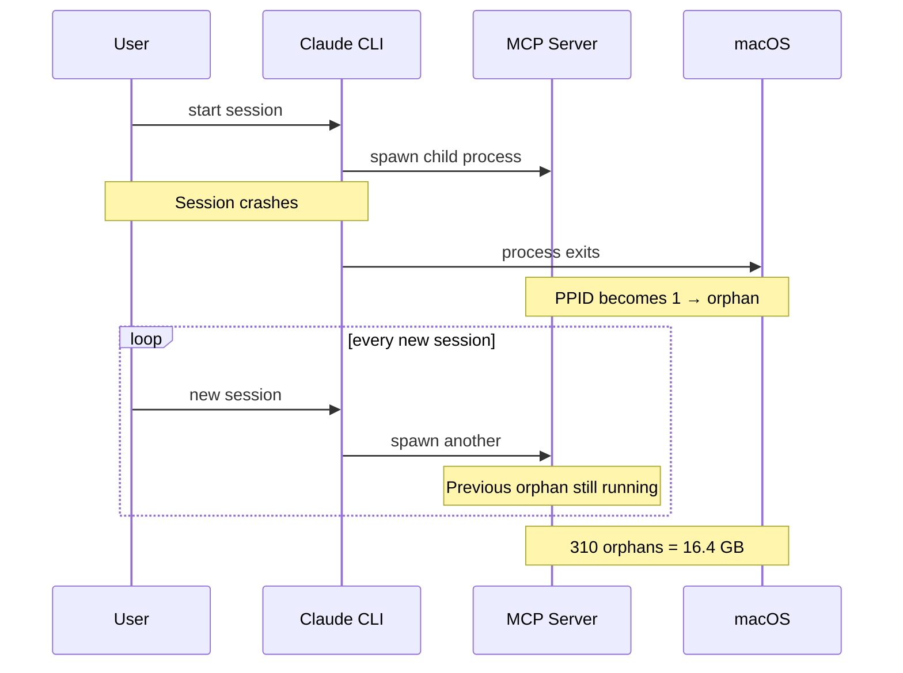
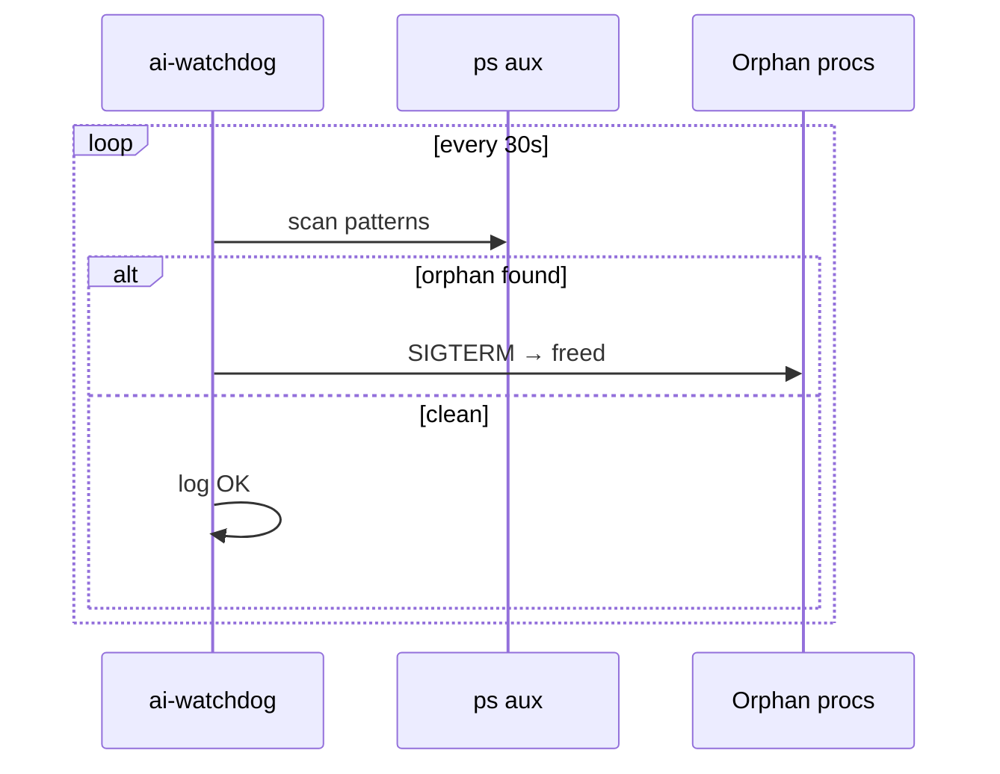
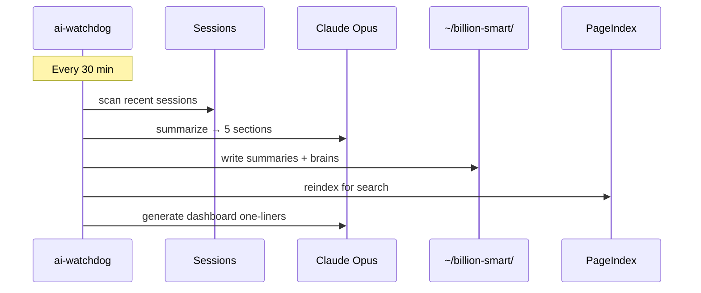

# ai-watchdog

**7x24 macOS daemon for AI coding teams — kills orphan MCP servers, guards memory, compounds knowledge.**

```
┌────────────────────────────────────────────────────────┐
│  HARNESS (Team)          │  COMPOUND (Personal)        │
│  Orphan reaper           │  LLM session summaries      │
│  Memory guard            │  Per-project brain files     │
│  Web dashboard           │  PageIndex semantic search   │
│  Session recovery        │  30-min auto knowledge loop  │
│                          │                              │
│  Deploy once → whole     │  Each session builds on      │
│  team benefits           │  the last one                │
└────────────────────────────────────────────────────────┘
  Supports: Claude · Codex · Cursor · Orba · Warp
```

---

## Actual Value

### For the Team (Harness)

**Problem:** AI tools spawn MCP child processes (Qdrant, Playwright, Figma MCP, etc.). Parent crashes → children become orphans → RAM disappears silently.

**Real incident:** 310 orphaned `server-qdrant.js` consumed 16.4 GB overnight. Mac had 339 MB free.

**Solution:** Install on every developer's Mac. Zero config. Orphans are killed within 30 seconds. Emergency cleanup kicks in before the machine locks up.

| What | How | Impact |
|---|---|---|
| Orphan reaper | Scans every 30s, kills PPID=1 MCP procs | No more zombie processes |
| Memory guard | Emergency kill at <512 MB, targeted at <2 GB | No more machine freezes |
| Swarm detection | Kills excess when >2 copies of same MCP server | Caps process sprawl |
| Session recovery | Lists last 5 sessions per tool with resume command | Never lose work |
| Log janitor | Deletes debug logs >3 days from .orba/.codex/.claude | Disk stays clean |
| Web dashboard | `localhost:7474` — kill button, session export | Fast triage |

### For the Individual (Compound)

**Problem:** "I solved this last week but forgot how." Knowledge decays between sessions.

**Solution:** Every 30 minutes, the daemon captures what you learned and indexes it for semantic retrieval.

```
Compound Engineering Loop:  Brainstorm → Plan → Work → Review → COMPOUND → Repeat
                                                                    ↑
                                                           ai-watchdog automates this
```

| What | How | Impact |
|---|---|---|
| Session memory | Scans Claude/Codex sessions every 30 min | Nothing is lost |
| LLM summaries | Claude Opus generates 5-section structured digest | What Worked / Failed / Decisions / Learnings / Open Issues |
| Dashboard summaries | One-liner per session in the web UI | Glanceable context |
| Project brains | `user-focus.md` (your messages) + `learnings.md` (AI summaries) | Per-project memory |
| PageIndex | Semantic search over all accumulated knowledge | "What did I learn about X?" |

The Compound layer is optional — without `.env`, the Harness still works fully.

---

## Quick Start

```bash
# Install (one-time, survives reboots)
git clone git@github.com:bianbiandashen/ai-watchdog.git ~/ai-watchdog
cd ~/ai-watchdog && ./install.sh

# Web dashboard (optional)
node web/server.js &
open http://localhost:7474

# Enable Compound layer (optional)
cat > .env << 'EOF'
OPENAI_API_KEY=your-key
OPENAI_BASE_URL=https://your-litellm-endpoint
SUMMARY_MODEL=anthropic/claude-opus-4.6
EOF
```

## Commands

| Command | What |
|---|---|
| `./tui.sh` | Live terminal dashboard |
| `node web/server.js` | Web dashboard on :7474 |
| `./status.sh` | Quick status print |
| `./watchdog.sh clean` | Run all cleanups now |
| `./watchdog.sh recover` | Session recovery menu |
| `./watchdog.sh snapshot` | Diagnostic snapshot |
| `./uninstall.sh` | Remove daemon |

## Configuration

`config.sh`:

```bash
CHECK_INTERVAL=30              # scan interval (seconds)
SYSTEM_MEM_MIN_FREE_MB=2048    # targeted cleanup threshold
SYSTEM_MEM_CRITICAL_MB=512     # emergency cleanup threshold
PROCESS_MEM_MAX_MB=4096        # single process kill threshold
ORPHAN_THRESHOLD=2             # max instances per MCP server
LOG_MAX_AGE_DAYS=3             # log retention
```

**Kill targets:** `server-qdrant.js` · `orba-context-mcp` · `figma.*mcp` · `playwright.*mcp` · `mitmproxy.*mcp` · `proxyman.*mcp` · `chrome-devtools-mcp` · `pageindex`

**Never touched:** `claude` · `codex` · `Cursor` · `OrbaDesktop` · `Warp`

---

## How the 30-Minute Cycle Works

```
Every 30 min the daemon runs 3 steps:

  ① generate_summary         → LLM summarizes sessions to ~/billion-smart/<project>/summaries/
  ② run_pageindex_reindex    → Re-indexes all markdown for semantic search
  ③ refresh_dashboard_summaries → LLM generates one-liners for the web UI
```

Knowledge storage:

```
~/billion-smart/
├── best-practices/           # superpowers / gstack / compound-engineering patterns
├── <project>/
│   ├── brain/
│   │   ├── user-focus.md     # Your recent messages (highest weight)
│   │   └── learnings.md      # AI-distilled summaries
│   └── summaries/            # Individual session digests (last 48)
├── _global/                  # Cross-project knowledge
└── pageindex-workspace/      # Semantic search index
```

---

## Screenshots

### Web Dashboard


---

## Project Structure

```
ai-watchdog/
├── watchdog.sh          # Daemon + CLI dispatcher
├── config.sh            # Thresholds and patterns
├── tui.sh               # Terminal dashboard
├── install.sh / uninstall.sh
├── lib/
│   ├── utils.sh         # Logging, notify, safe_kill
│   ├── monitor.sh       # Orphan detection, memory pressure
│   ├── cleanup.sh       # Kill routines
│   ├── recovery.sh      # Session recovery
│   └── memory.sh        # Compound: summaries, PageIndex, dashboard refresh
├── web/
│   ├── server.js        # API server (zero npm deps, port 7474)
│   └── public/index.html
└── logs/                # (gitignored)
```

## Requirements

- macOS 12+, Bash 5+, Python 3
- Node.js 18+ (optional, web dashboard)
- LLM API (optional, Compound layer)

Zero npm dependencies.

---

<details>
<summary><strong>Architecture Diagrams (click to expand)</strong></summary>

### Orphan Accumulation (the problem)



### Harness: Scan Cycle



### Compound: Knowledge Cycle



</details>

---

## FAQ

**Will this kill my Claude/Codex session?** No. CLI tools and GUI apps are protected.

**Can I use just Harness without Compound?** Yes. Without `.env`, Compound silently skips.

**Does it send my code to an API?** No. Only first-line user messages (truncated to 200 chars) for summaries.

**Linux?** Not yet — uses macOS APIs. PRs welcome.

---

## License

[MIT](LICENSE)
