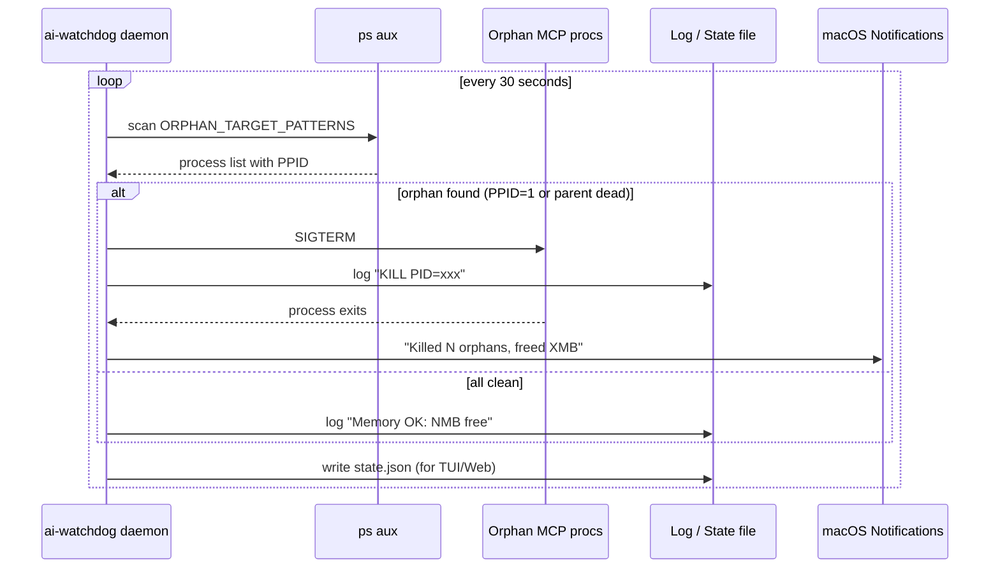
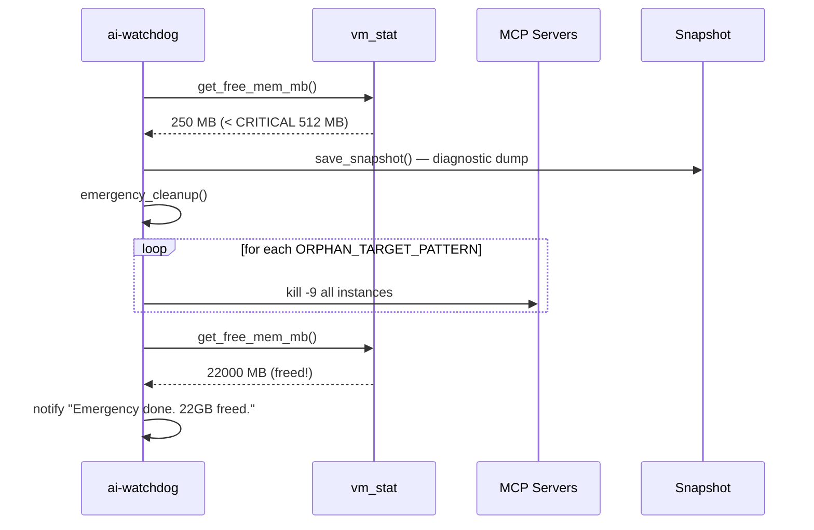
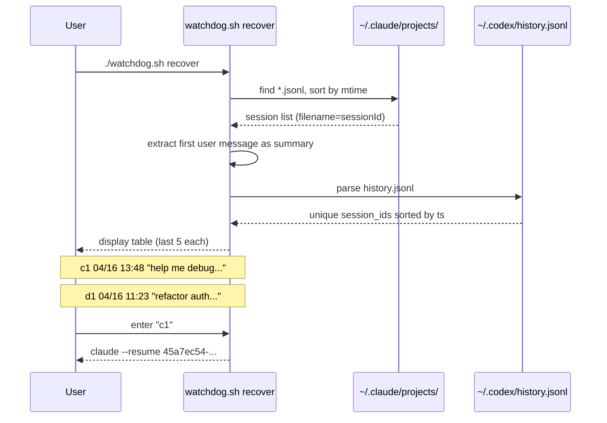
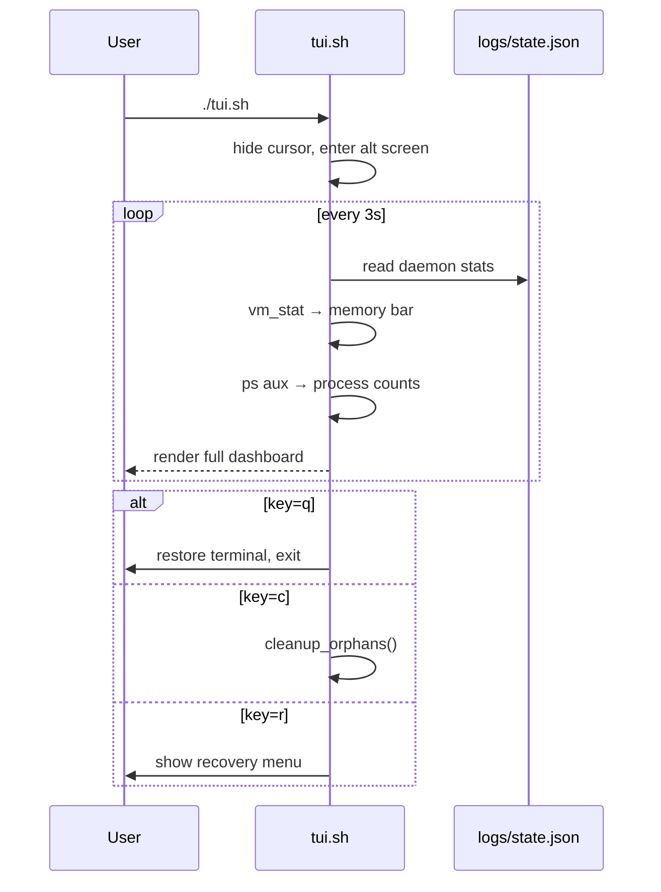

# ai-watchdog


**7×24 process guardian for Claude · Codex · Cursor · Orba · Warp on macOS — kills orphan MCP servers, guards memory, recovers sessions.**

> Woke up to find my Mac had **339 MB free** out of 48 GB — because **310 orphaned `server-qdrant.js`** MCP processes silently ate **16.4 GB** overnight.
> `ai-watchdog` makes sure that never happens again.

---

## Screenshots

### Web Dashboard (`http://localhost:7474`)


### Terminal TUI (`./tui.sh`)

Live ANSI dashboard with memory bars, process tables, session recovery, and keyboard shortcuts.

---

## The Problem

Every time you start a Claude Code / Codex / Cursor / Orba session, these tools spawn **MCP server child processes** (Qdrant, Playwright, Figma, mitmproxy, Chrome DevTools, etc.). When the parent session crashes or exits abnormally, the children keep running forever — consuming gigabytes of RAM.

```
Morning discovery:
  Orphan server-qdrant.js:  310 processes  →  16.4 GB RAM
  System free memory:                       →  339 MB
  Result:                                   →  Mac grinding to halt
```

### What ai-watchdog does

| Capability | How |
|---|---|
| **Orphan reaper** | Scans every 30s, kills MCP server procs whose parent died (PPID=1) |
| **Swarm detection** | Kills extras when N copies of the same MCP server exceed threshold |
| **Memory guard** | Emergency cleanup when free RAM < 512 MB; "Clean to 60%" one-click |
| **Web dashboard** | Real-time browser UI on `localhost:7474` — kill any process, export sessions |
| **Live TUI** | ANSI terminal dashboard refreshing every 3s — memory bars, process counts |
| **Session recovery** | Lists last 5 sessions for Claude and Codex, prints resume command |
| **Log janitor** | Deletes `debug-*.log` older than 3 days from `.orba`, `.codex`, `.claude` |
| **LaunchAgent** | Starts on login via launchd, restarts automatically if it crashes |
| **Never kills CLI** | `claude`, `codex`, `Cursor`, `OrbaDesktop`, `Warp` — all protected |

---

## Alternatives Comparison

| Feature | ai-watchdog | mcp-orphan-monitor | mcp-cleanup | process-police | ccboard |
|---|:---:|:---:|:---:|:---:|:---:|
| Orphan detection & kill | **Yes** | Yes | Yes | Yes | No |
| Memory pressure guard | **Yes** | No | No | No | No |
| Web dashboard | **Yes** | No | No | No | Yes |
| Terminal TUI | **Yes** | No | No | Yes (Linux) | No |
| Session recovery | **Yes** | No | No | No | View only |
| launchd auto-start | **Yes** | Yes | Yes | No | No |
| macOS native | **Yes** | Yes | Yes | Linux only | Cross |
| Zero dependencies | **Yes** | No (Python) | Yes | No (Rust) | No (Rust) |

---

<details>
<summary><strong>Architecture — Sequence Diagrams (click to expand)</strong></summary>

### 1 · Orphan Accumulation (the problem)


### 2 · Watchdog Normal Cycle



### 3 · Memory Pressure Emergency



### 4 · Session Recovery Flow



### 5 · TUI Live Dashboard Loop



### 6 · launchd Auto-Start & Keep-Alive


</details>

---

## Installation

```bash
git clone git@github.com:bianbiandashen/ai-watchdog.git ~/ai-watchdog
cd ~/ai-watchdog
./install.sh
```

That's it. The watchdog starts immediately and survives reboots.

### Web Dashboard (optional)

```bash
node web/server.js &
open http://localhost:7474
```

---

## Usage

| Command | What it does |
|---|---|
| `./tui.sh` | Open live ANSI dashboard |
| `node web/server.js` | Start web dashboard on port 7474 |
| `./status.sh` | Quick one-shot status print |
| `./watchdog.sh clean` | Manually run all cleanups now |
| `./watchdog.sh recover` | Interactive session recovery menu |
| `./watchdog.sh snapshot` | Save diagnostic snapshot |
| `./uninstall.sh` | Stop daemon and remove LaunchAgent |

---

## Configuration

All thresholds live in `config.sh`:

```bash
CHECK_INTERVAL=30              # scan every 30 seconds
SYSTEM_MEM_MIN_FREE_MB=2048    # warn + cleanup when free < 2 GB
SYSTEM_MEM_CRITICAL_MB=512     # emergency kill when free < 512 MB
PROCESS_MEM_MAX_MB=4096        # kill single proc exceeding 4 GB
ORPHAN_THRESHOLD=2             # keep at most 2 instances per MCP server
LOG_MAX_AGE_DAYS=3             # delete debug logs older than 3 days
```

### What gets killed vs. protected

**Only these MCP patterns are eligible for killing** (`ORPHAN_TARGET_PATTERNS`):
- `server-qdrant.js` — Qdrant Vector DB
- `orba-context-mcp` / `orba-context@` — Orba Context MCP servers
- `figma.*mcp`, `playwright.*mcp`, `ChromeDevTools.*mcp`, `mitmproxy.*mcp`, `proxyman.*mcp`
- `plugin_miniprogram`, `mp-cli.*mcp`

**These are NEVER touched** (`NEVER_KILL_PATTERNS`):
- `claude`, `codex` — CLI tools (your active sessions)
- `Cursor`, `OrbaDesktop`, `Warp` — GUI apps
- Any process matching `claude.*--dangerously` — active Claude Code sessions

---

## Project Structure

```
ai-watchdog/
├── watchdog.sh          # Main daemon + CLI dispatcher
├── tui.sh               # Live ANSI terminal dashboard
├── status.sh            # Quick one-shot status
├── install.sh           # launchd LaunchAgent installer
├── uninstall.sh         # Remove LaunchAgent
├── config.sh            # All thresholds and patterns
├── lib/
│   ├── utils.sh         # Logging, notify, memory helpers, safe_kill
│   ├── monitor.sh       # Orphan detection, memory pressure, snapshots
│   ├── cleanup.sh       # Kill routines: orphans, hogs, emergency, logs
│   └── recovery.sh      # Session list parser and resume helper
├── web/
│   ├── server.js        # Node.js API server (zero deps, port 7474)
│   └── public/
│       └── index.html   # Single-file SPA dashboard
├── docs/                # Screenshots
└── logs/                # watchdog.log, state.json, snapshots/ (gitignored)
```

---

## Requirements

- macOS 12+ (uses `launchctl`, `vm_stat`, `osascript`)
- Bash 5+ (`brew install bash` if needed)
- Python 3 (pre-installed on macOS, used for JSON parsing in recovery)
- Node.js 18+ (optional, for web dashboard only)

---

## FAQ

**Will this kill my Claude / Codex session?**
No. All CLI tools and GUI apps are in the `NEVER_KILL_PATTERNS` list. Only MCP server subprocesses (Qdrant, Playwright, Figma MCP, etc.) are eligible.

**Does this work on Linux?**
Not yet — it uses macOS-specific APIs (`vm_stat`, `osascript`, `launchctl`). PRs welcome.

**How do I change the scan interval?**
Edit `CHECK_INTERVAL` in `config.sh`. Default is 30 seconds.

**What's the "Clean to 60%" button?**
It kills MCP processes biggest-first until system memory usage drops below 60%. The 80% red line on the gauge shows when you should start cleaning.

---

## Contributing

1. Fork the repo
2. Create a feature branch (`git checkout -b feat/my-feature`)
3. Keep the zero-dependency constraint (no npm packages for the bash daemon)
4. Test on macOS
5. Submit a PR

---

## License

[MIT](LICENSE)
