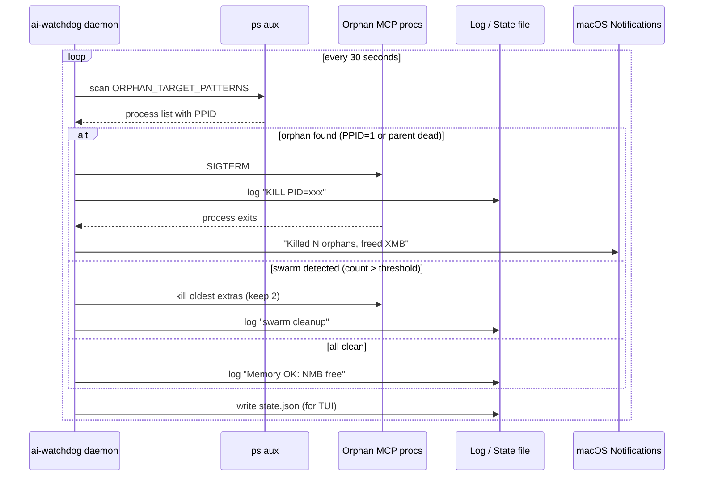
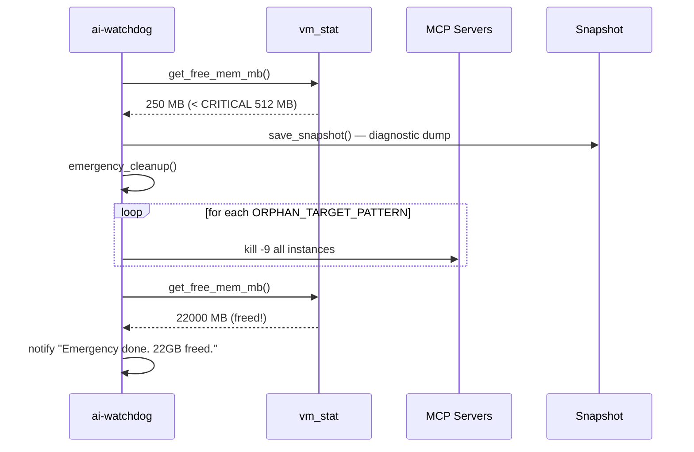
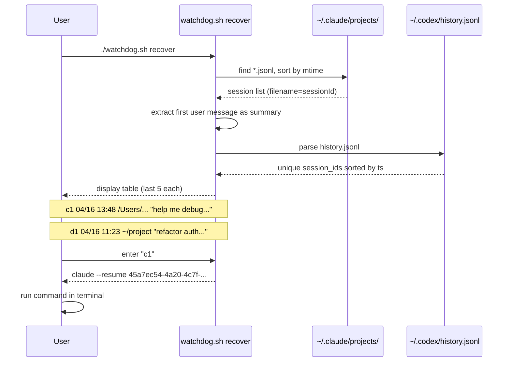
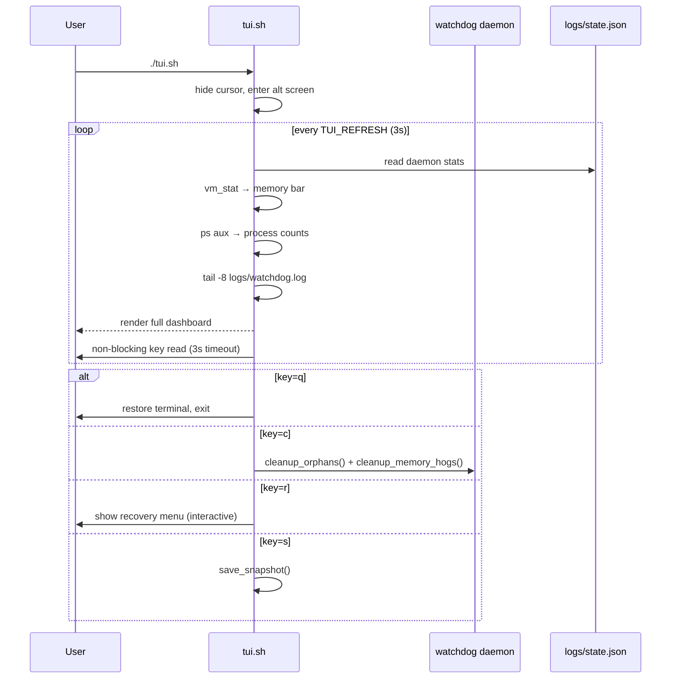
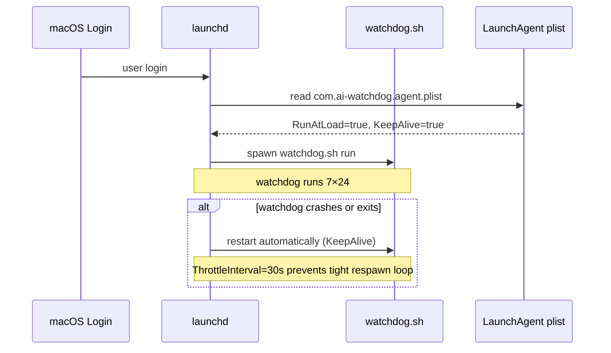

# ai-watchdog 🔎

**7×24 process guardian for Claude · Codex · Cursor · Orba on macOS**

> Woke up this morning to find my Mac had 339 MB of free memory left — down from 48 GB — because 310 orphaned `server-qdrant.js` MCP server processes had silently eaten 16 GB overnight.  
> `ai-watchdog` makes sure that never happens again.

---

## The Problem

Every time you start a Claude Code / Codex / Cursor / Orba session, these tools spawn **MCP server child processes**. When the parent session crashes or exits abnormally, the children keep running forever — consuming gigabytes of RAM, burning CPU, and eventually making the machine unusable.

```
Morning discovery:
  Orphan server-qdrant.js:  310 processes  →  16.4 GB RAM
  System free memory:                       →  339 MB
  Result:                                   →  Mac grinding halt
```

### What ai-watchdog does

| Capability | How |
|---|---|
| **Orphan reaper** | Scans every 30 s, kills MCP server procs whose parent died |
| **Swarm detection** | Kills extras when N copies of the same MCP server exceed threshold |
| **Memory guard** | Emergency cleanup when free RAM < 512 MB |
| **Log janitor** | Deletes `debug-*.log` files older than 3 days from `.orba`, `.codex`, `.claude` |
| **Session recovery** | Lists last 5 sessions each for Claude and Codex, prints resume command |
| **Live TUI** | ANSI dashboard refreshing every 3 s — memory bars, process counts, log tail |
| **LaunchAgent** | Starts on login via launchd, restarts automatically if it crashes |
| **Never kills CLI** | `claude`, `codex`, `Cursor`, `OrbaDesktop`, `Warp` — all protected |

---

## Sequence Diagrams

### 1 · Orphan Accumulation (the problem this solves)


---

### 2 · Watchdog Normal Cycle



---

### 3 · Memory Pressure Emergency



---

### 4 · Session Recovery Flow



---

### 5 · TUI Live Dashboard Loop



---

### 6 · launchd Auto-Start & Keep-Alive



---

## Installation

```bash
git clone git@github.com:bianbiandashen/ai-watchdog.git ~/ai-watchdog
cd ~/ai-watchdog
./install.sh
```

That's it. The watchdog starts immediately and survives reboots.

## Usage

| Command | What it does |
|---|---|
| `./tui.sh` | Open live ANSI dashboard |
| `./status.sh` | Quick one-shot status print |
| `./watchdog.sh clean` | Manually run all cleanups now |
| `./watchdog.sh recover` | Interactive session recovery menu |
| `./watchdog.sh snapshot` | Save diagnostic snapshot to `logs/snapshots/` |
| `./uninstall.sh` | Stop daemon and remove LaunchAgent |

## Configuration

All thresholds live in `config.sh`:

```bash
CHECK_INTERVAL=30              # scan every 30 seconds
SYSTEM_MEM_MIN_FREE_MB=2048    # warn + cleanup when free < 2 GB
SYSTEM_MEM_CRITICAL_MB=512     # emergency kill when free < 512 MB
PROCESS_MEM_MAX_MB=4096        # kill single proc exceeding 4 GB
ORPHAN_THRESHOLD=2             # keep at most 2 instances of each MCP server
LOG_MAX_AGE_DAYS=3             # delete debug logs older than 3 days
```

### What gets killed vs. protected

**Only these patterns are eligible for killing** (`ORPHAN_TARGET_PATTERNS`):
- `server-qdrant.js` — Qdrant MCP server
- `orba-context-mcp` / `orba-context@` — Orba MCP servers
- `figma.*mcp`, `mitmproxy.*mcp`, `playwright.*mcp`, etc.

**These are NEVER touched** (`NEVER_KILL_PATTERNS`):
- `claude`, `codex` — CLI tools (your active sessions)
- `Cursor`, `OrbaDesktop`, `Warp` — GUI apps
- Any process matching `claude.*--dangerously` — active Claude Code sessions

## Project Structure

```
ai-watchdog/
├── watchdog.sh          # Main daemon + CLI dispatcher
├── tui.sh               # Live ANSI terminal dashboard
├── status.sh            # Quick one-shot status
├── install.sh           # launchd LaunchAgent installer
├── uninstall.sh         # Remove LaunchAgent
├── config.sh            # All thresholds and patterns
├── lib/
│   ├── utils.sh         # Logging, notify, memory helpers, safe_kill
│   ├── monitor.sh       # Orphan detection, memory pressure, snapshots
│   ├── cleanup.sh       # Kill routines: orphans, hogs, emergency, logs
│   └── recovery.sh      # Session list parser and resume helper
└── logs/                # watchdog.log, state.json, snapshots/ (gitignored)
```

## Requirements

- macOS 12+ (uses `launchctl`, `vm_stat`, `osascript`)
- Bash 5+ (`brew install bash` if needed)
- Python 3 (pre-installed on macOS, used for JSON parsing in recovery)

## License

MIT
