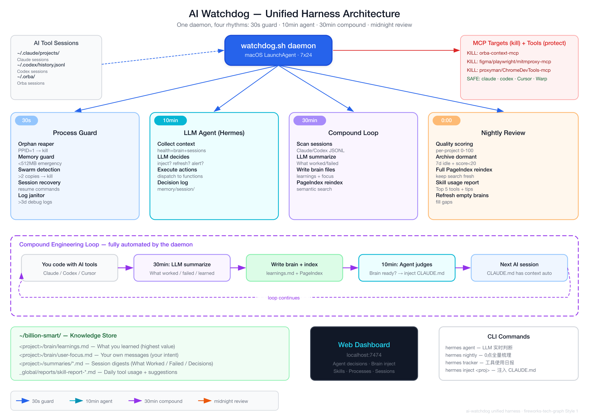

# ai-watchdog

## 7x24 AI 开发守护进程

一个 macOS 后台守护进程，四件事全自动：**杀孤儿进程 · 记知识笔记 · 智能判断写回 CLAUDE.md · 每天出报告**。

### 它跟我的 Claude / Codex / Orba 是什么关系？

你每天用 Claude、Codex、Orba、Cursor 写代码。**ai-watchdog 是在它们背后 7x24 运行的守护进程 — 四个节奏全自动：**

```
你的工具                   watchdog 在背后做的事（全是一个 Harness 守护进程）
─────────                 ────────────────────────────────────────────

~/.claude/ → Claude        每 30s:  Claude 崩了留下孤儿 MCP 进程吃内存
~/.codex/  → Codex                  → 30 秒内自动清理掉
~/.orba/   → Orba
Cursor     → MCP 插件      每 10min: LLM agent 看一眼系统状态
                                    → brain 够了？自动 inject 到 CLAUDE.md
                                    → brain 空的？先触发重新生成

                           每 30min: 扫描你的 AI 对话
                                    → What worked / What failed / Learnings
                                    → 写入 brain 文件 + PageIndex 索引

                           每天 0 点: 全量知识梳理
                                    → 每个项目质量打分
                                    → 冷项目归档、PageIndex 全量 reindex
                                    → 今天用了哪些工具？Top 5 + 建议
```

**一句话：** 你专心写代码，watchdog 帮你收拾进程、记住知识、写回 CLAUDE.md、出日报。

```
支持: Claude · Codex · Cursor · Orba · Warp
```

### 架构图



> 架构图使用 [fireworks-tech-graph](https://www.npmjs.com/package/@yizhiyanhua-ai/fireworks-tech-graph) 生成。

---

### 一个守护进程，四个节奏

都是一个 `watchdog.sh` 后台进程在干的事，不分层，四个节奏：

**每 30 秒 — 进程守护（零配置就能用）**

| 功能 | 效果 |
|---|---|
| 孤儿进程收割 | PPID=1 的 MCP 进程 30s 内被 kill |
| 内存守卫 | <512MB 紧急 kill，<2GB 定向清理 |
| 群集检测 | 同一 MCP 超过 2 个副本时 kill 多余的 |
| 会话恢复 | 每个工具最近 5 个会话，一键 resume |

> 真实案例：310 个孤儿 `server-qdrant.js` 一夜吃 16.4 GB，Mac 仅剩 339 MB。

**每 10 分钟 — LLM Agent 实时判断（需要 .env 里的 API key）**

Agent 收集完整上下文（健康报告 + 知识分数 + brain 状态 + 上次决策），调 LLM 判断该做什么。借鉴 [Hermes Agent](https://github.com/NousResearch/hermes-agent) 的 agent loop 模式 — 不是规则引擎，是真正的推理。

```bash
./watchdog.sh hermes agent   # 手动触发一次看看 agent 会做什么

# 实测输出：
# → inject (ai-watchdog) — brain 1.3KB, CLAUDE.md missing
# → noop — 上次刚做过 inject，等结果
```

| Agent 判断 | 触发条件 |
|---|---|
| inject brain → CLAUDE.md | brain 有内容 + CLAUDE.md 缺失/过时 |
| 重新生成 brain | brain 为空但有新会话数据 |
| 生成会话摘要 | 有未总结的新会话 |
| alert 告警 | 内存 >90% 或 MCP >20 个 |

**每 30 分钟 — Compound Engineering 知识循环**

扫描你和 AI 对话的内容，用 LLM 做结构化总结，完成 Compound Engineering 循环：

```
After EVERY task, ask:
  ① What worked?              → brain/learnings.md
  ② What failed?              → summaries/ (anti-patterns)
  ③ What would I do differently? → Agent 自动 inject 到 CLAUDE.md
```

| 功能 | 效果 |
|---|---|
| LLM 会话摘要 | What Worked / Failed / Decisions / Learnings / Open Issues |
| 项目 Brain 文件 | `user-focus.md`（你说的话）+ `learnings.md`（AI 总结） |
| PageIndex 索引 | 全量知识语义搜索："上周我学到了什么关于 X 的？" |

**每天 0 点 — 全量知识梳理 + 日报**

```bash
./watchdog.sh hermes nightly   # 手动触发

# 做什么：
# 1. LLM 评估每个项目的知识质量
# 2. 冷项目归档 (7天没碰 + 分数<20)
# 3. 空 brain 触发重新生成
# 4. 全量 PageIndex reindex
# 5. 生成今日工具使用报告（Top 5 工具 + 使用建议）
```

工具使用日报示例：
```bash
./watchdog.sh hermes tracker   # 看最近 24 小时的工具使用统计

# Sessions: 13 | Messages: 1543 | Tool calls: 446
# Top 5:
#   Bash (129) — 考虑用 Read/Edit/Grep 替代部分 shell 调用
#   Read (80)  — 探索型工作流，可以用 Agent/Explore 做更广的搜索
#   Edit (80)  — 高产出！如果重复编辑，让 Claude 写 codemod
#   TaskUpdate (40) — 多步任务管理活跃，保持这个节奏
#   Write (29) — 新建文件多，确认是否可以扩展已有文件
```

> 有 `.env` 时四个节奏全部启动。没有 `.env` 时只有第一个节奏（进程守护），零配置。LLM 调用失败时自动降级。

---

### 快速开始

```bash
# 安装 (一次性，重启后自动运行)
git clone git@github.com:bianbiandashen/ai-watchdog.git ~/ai-watchdog
cd ~/ai-watchdog && ./install.sh

# Web 仪表盘 (可选)
node web/server.js &
open http://localhost:7474

# 启用 Compound + Hermes (可选)
cp .env.example .env
# 编辑 .env 填入 API key 和 webhook URL
```

### 命令

| 命令 | 说明 |
|---|---|
| `./tui.sh` | 终端实时仪表盘 |
| `node web/server.js` | Web 仪表盘 :7474 |
| `./status.sh` | 快速状态检查 |
| `./watchdog.sh clean` | 立即执行清理 |
| `./watchdog.sh recover` | 会话恢复菜单 |
| `./watchdog.sh snapshot` | 诊断快照 |
| `./watchdog.sh hermes inject devin` | 把 devin 的 Brain 注入到 CLAUDE.md |
| `./watchdog.sh hermes inject` | 列出所有可注入的项目 |
| `./watchdog.sh hermes digest '{"days":7}'` | 7 天知识体检报告 |
| `./watchdog.sh hermes status` | Hermes 健康报告 |
| `./watchdog.sh hermes exec health-check '{}'` | 执行诊断技能 |
| `./uninstall.sh` | 卸载 |

### 项目结构

```
ai-watchdog/
├── watchdog.sh            # 守护进程 + CLI
├── config.sh              # 阈值和模式配置
├── tui.sh                 # 终端仪表盘
├── install.sh / uninstall.sh / status.sh
├── lib/
│   ├── utils.sh           # 日志、通知、safe_kill
│   ├── monitor.sh         # 孤儿检测、内存压力
│   ├── cleanup.sh         # 清理例程
│   ├── recovery.sh        # 会话恢复
│   ├── memory.sh          # Compound: 摘要、PageIndex
│   └── hermes.sh          # Hermes: 通知、技能、记忆、MoA
├── skills/
│   ├── health-check/      # 系统健康检查技能
│   ├── session-analyzer/  # 会话分析技能
│   └── anomaly-detector/  # 异常检测技能
├── memory/                # 分层记忆存储 (gitignored)
│   ├── instant/           # 即时键值
│   ├── session/           # 会话追加日志
│   └── overflow/          # 归档
├── web/
│   ├── server.js          # API 服务 (零依赖, :7474)
│   └── public/index.html  # SPA 仪表盘
└── logs/                  # (gitignored)
```

---

---

# ai-watchdog

## 7x24 AI Tool Guardian + Hermes Agent Intelligence

macOS daemon for AI coding teams — kills orphan MCP servers, guards memory, compounds knowledge, and adds Hermes-style agent intelligence.

### How does this relate to my Claude / Codex / Orba?

You use Claude, Codex, Orba, Cursor every day to write code. **ai-watchdog doesn't replace them — it's the crew working behind the scenes: cleaning up, taking notes, and standing guard.**

```
Your AI tools                     What ai-watchdog does behind the scenes
────────────                     ──────────────────────────────────────

~/.claude/  → Claude CLI          Harness:  Claude crashes, leaves behind
               spawns MCP procs            orphan MCP processes eating RAM
                                           → watchdog kills them in 30 seconds

~/.codex/   → Codex CLI           Compound: You had a 2-hour coding session,
               generates code              learned a ton, forgot it by tomorrow
                                           → watchdog summarizes every 30 min
                                             saves to ~/billion-smart/

~/.orba/    → Orba Desktop        Hermes:   You're away from your desk,
               runs 10+ MCPs              MCP processes suddenly spike
                                           → watchdog sends you a DingTalk/Slack alert

Cursor      → various MCP plugins Recovery: Claude session dropped unexpectedly
                                           → watchdog finds it, one-click resume
```

**In one sentence:** You focus on coding with your AI tools. Watchdog cleans up the mess, remembers what you learned, and yells when something breaks.

```
┌──────────────────┬───────────────────┬───────────────────┐
│  HARNESS (Team)  │  COMPOUND (Self)  │  HERMES (Agent)   │
│  Orphan reaper   │  LLM summaries    │  Multi-channel    │
│  Memory guard    │  Project brains   │  Skills engine    │
│  Web dashboard   │  PageIndex search │  Tiered memory    │
│  Session recovery│  30-min loop      │  MoA analysis     │
└──────────────────┴───────────────────┴───────────────────┘
  Supports: Claude · Codex · Cursor · Orba · Warp
```

### Architecture


> Architecture diagram generated with [fireworks-tech-graph](https://www.npmjs.com/package/@yizhiyanhua-ai/fireworks-tech-graph), Style 1 Flat Icon with semantic arrows on white background.

---

### Value Proposition

#### For the Team (Harness)

**Problem:** AI tools spawn MCP child processes (Qdrant, Playwright, Figma MCP, etc.). Parent crashes -> children become orphans -> RAM disappears silently.

**Real incident:** 310 orphaned `server-qdrant.js` consumed 16.4 GB overnight. Mac had 339 MB free.

**Solution:** Install on every developer's Mac. Zero config. Orphans killed within 30 seconds. Emergency cleanup fires before the machine locks up.

| Feature | How | Impact |
|---|---|---|
| Orphan reaper | Scans every 30s, kills PPID=1 MCP procs | No zombie processes |
| Memory guard | Emergency kill at <512 MB, targeted at <2 GB | No machine freezes |
| Swarm detection | Kills excess when >2 copies of same MCP server | Caps process sprawl |
| Session recovery | Lists last 5 sessions per tool with resume command | Never lose work |
| Log janitor | Deletes debug logs >3 days from .orba/.codex/.claude | Disk stays clean |
| Web dashboard | `localhost:7474` — kill button, session export | Fast triage |

#### For the Individual (Compound)

Every 30 minutes, the daemon captures what you learned and indexes it for semantic retrieval.

| Feature | How | Impact |
|---|---|---|
| Session memory | Scans Claude/Codex sessions every 30 min | Nothing lost |
| LLM summaries | Claude Opus generates 5-section digest | What Worked / Failed / Decisions / Learnings / Open Issues |
| Project brains | `user-focus.md` + `learnings.md` per project | Per-project memory |
| PageIndex | Semantic search over all knowledge | "What did I learn about X?" |

#### Agent Intelligence (Hermes) — Completing the Compound Engineering Loop

The three layers form a chain:

```
You code (Claude/Codex/Cursor)
    ↓
Compound auto-summarizes every 30 min:
    ① What worked?      → summaries/*.md + brain/learnings.md
    ② What failed?      → summaries/*.md (anti-patterns)
    ③ Key decisions      → brain/index.md
    ↓
PageIndex indexes all knowledge → semantic search ready
    ↓
But who does step ④?
    ④ Write learnings back into CLAUDE.md → next AI session has context automatically
    ↓
Hermes Agent does step ④ + judges quality:
    • Brain is ready?      → auto-inject into CLAUDE.md
    • Brain is empty?      → trigger refresh_brains first
    • Sessions unsummarized? → trigger generate_summaries
    • Every midnight:       full quality review + archive stale projects + PageIndex reindex
```

**What Hermes borrows:** The [Hermes Agent](https://github.com/NousResearch/hermes-agent) agent loop pattern — collect context → LLM reasoning → dispatch actions. Not a rule engine; it actually calls an LLM to decide.

**Two rhythms:**

**Every 10 min (realtime)** — LLM decides what to do:

```bash
./watchdog.sh hermes agent   # trigger manually to see decisions

# Example output:
# HERMES AGENT: → inject (devin) — brain 1.2KB, CLAUDE.md missing
# HERMES AGENT: → noop — injected last cycle, waiting for results
```

**Every midnight (full review)** — LLM evaluates knowledge quality:

```bash
./watchdog.sh hermes nightly  # trigger manually

# What it does:
# 1. Score each project's knowledge quality
# 2. Archive dormant projects (7+ days idle, score < 20)
# 3. Refresh empty brains if session data exists
# 4. Full PageIndex reindex
```

> Compound and Hermes layers are optional — without `.env`, Harness works standalone. With `.env` but LLM fails, Hermes auto-degrades to basic patrol.

---

### Quick Start

```bash
# Install (one-time, survives reboots)
git clone git@github.com:bianbiandashen/ai-watchdog.git ~/ai-watchdog
cd ~/ai-watchdog && ./install.sh

# Web dashboard (optional)
node web/server.js &
open http://localhost:7474

# Enable Compound + Hermes (optional)
cp .env.example .env
# Edit .env with your API key and webhook URLs
```

### Commands

| Command | What |
|---|---|
| `./tui.sh` | Live terminal dashboard |
| `node web/server.js` | Web dashboard on :7474 |
| `./status.sh` | Quick status print |
| `./watchdog.sh clean` | Run all cleanups now |
| `./watchdog.sh recover` | Session recovery menu |
| `./watchdog.sh snapshot` | Diagnostic snapshot |
| `./watchdog.sh hermes inject devin` | Inject devin's Brain into CLAUDE.md |
| `./watchdog.sh hermes inject` | List all injectable projects |
| `./watchdog.sh hermes digest '{"days":7}'` | 7-day knowledge health report |
| `./watchdog.sh hermes status` | Hermes health report (JSON) |
| `./watchdog.sh hermes exec health-check '{}'` | Run a diagnostic skill |
| `./uninstall.sh` | Remove daemon |

### Configuration

`config.sh`:

```bash
CHECK_INTERVAL=30              # scan interval (seconds)
SYSTEM_MEM_MIN_FREE_MB=2048    # targeted cleanup threshold
SYSTEM_MEM_CRITICAL_MB=512     # emergency cleanup threshold
PROCESS_MEM_MAX_MB=4096        # single process kill threshold
ORPHAN_THRESHOLD=2             # max instances per MCP server
HERMES_ENABLED=true            # Hermes agent layer
HERMES_CYCLE_INTERVAL=20       # Hermes cycle (every N daemon cycles)
```

`.env` (notification channels):

```bash
OPENAI_API_KEY=your-key
OPENAI_BASE_URL=https://your-litellm-endpoint
TELEGRAM_BOT_TOKEN=your-bot-token
TELEGRAM_CHAT_ID=your-chat-id
DISCORD_WEBHOOK_URL=https://discord.com/api/webhooks/...
SLACK_WEBHOOK_URL=https://hooks.slack.com/services/...
DINGTALK_WEBHOOK_URL=https://oapi.dingtalk.com/robot/send?access_token=...
FEISHU_WEBHOOK_URL=https://open.feishu.cn/open-apis/bot/v2/hook/...
```

### Project Structure

```
ai-watchdog/
├── watchdog.sh            # Daemon + CLI dispatcher
├── config.sh              # Thresholds and patterns
├── tui.sh                 # Terminal dashboard
├── install.sh / uninstall.sh / status.sh
├── lib/
│   ├── utils.sh           # Logging, notify, safe_kill
│   ├── monitor.sh         # Orphan detection, memory pressure
│   ├── cleanup.sh         # Kill routines
│   ├── recovery.sh        # Session recovery
│   ├── memory.sh          # Compound: summaries, PageIndex
│   └── hermes.sh          # Hermes: notify, skills, memory, MoA
├── skills/
│   ├── health-check/      # System health check skill
│   ├── session-analyzer/  # Session pattern analysis skill
│   └── anomaly-detector/  # Anomaly detection skill
├── memory/                # Tiered memory storage (gitignored)
│   ├── instant/           # Key-value snapshots
│   ├── session/           # Append-only session logs
│   └── overflow/          # Archive tier
├── web/
│   ├── server.js          # API server (zero npm deps, :7474)
│   └── public/index.html  # SPA dashboard
└── logs/                  # (gitignored)
```

### Requirements

- macOS 12+, Bash 3.2+, Python 3
- Node.js 18+ (optional, web dashboard)
- LLM API (optional, Compound + Hermes layers)

Zero npm dependencies.

---

### FAQ

**Will this kill my Claude/Codex session?** No. CLI tools and GUI apps are protected by `NEVER_KILL_PATTERNS`.

**Can I use just Harness without Compound/Hermes?** Yes. Without `.env`, both layers silently skip.

**Does it send my code to an API?** No. Only first-line user messages (truncated to 300 chars) for summaries.

**How do I add a custom skill?** Create `skills/<name>/SKILL.md` + `skills/<name>/skill.sh`. The script reads JSON from stdin, writes JSON to stdout.

**Linux?** Not yet — uses macOS APIs (`vm_stat`, `launchctl`, `osascript`). PRs welcome.

---

### License

[MIT](LICENSE)
